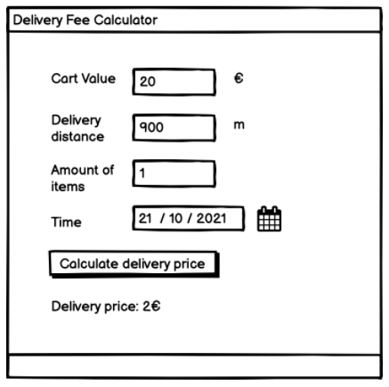

# Front-end Assignment - Software Engineering Internship (Summer 2023)
Preliminary Assignment for Engineering Positions

Welcome! We are delighted to see you applying. Now it's your time to shine.

**NOTE! Please do only *one* of backend, frontend OR mobile implementation.**

## Delivery Fee Calculator

The goal of the assignment is to showcase your coding skills and ability to develop features. We DON'T expect you to build production quality code. This is a highly important part of the hiring process so it's crucial to put effort into this without making it too bloated. Reviewers will put weight on three main aspects: code quality, maintainability, and testing. Based on the results of the assignment review, we will make the decision on proceeding to the technical interview.

Your task is to write a delivery fee calculator. This code is needed when a customer is ready with their shopping cart and we’d like to show them how much the delivery will cost. The delivery price depends on the cart value, the number of items in the cart, the time of the order, and the delivery distance.

### Specification
Rules for calculating a delivery fee
* If the cart value is less than 10€, a small order surcharge is added to the delivery price. The surcharge is the difference between the cart value and 10€. For example if the cart value is 8.90€, the surcharge will be 1.10€.
* A delivery fee for the first 1000 meters (=1km) is 2€. If the delivery distance is longer than that, 1€ is added for every additional 500 meters that the courier needs to travel before reaching the destination. Even if the distance would be shorter than 500 meters, the minimum fee is always 1€.
  * Example 1: If the delivery distance is 1499 meters, the delivery fee is: 2€ base fee + 1€ for the additional 500 m => 3€
  * Example 2: If the delivery distance is 1500 meters, the delivery fee is: 2€ base fee + 1€ for the additional 500 m => 3€
  * Example 3: If the delivery distance is 1501 meters, the delivery fee is: 2€ base fee + 1€ for the first 500 m + 1€ for the second 500 m => 4€
* If the number of items is five or more, an additional 50 cent surcharge is added for each item above five. An extra "bulk" fee applies for more than 12 items of 1,20€
  * Example 1: If the number of items is 4, no extra surcharge
  * Example 2: If the number of items is 5, 50 cents surcharge is added
  * Example 3: If the number of items is 10, 3€ surcharge (6 x 50 cents) is added
  * Example 4: If the number of items is 13, 5,70€ surcharge is added ((9 * 50 cents) + 1,20€)
* The delivery fee can __never__ be more than 15€, including possible surcharges.
* The delivery is free (0€) when the cart value is equal or more than 100€. 
* During the Friday rush (3 - 7 PM UTC), the delivery fee (the total fee including possible surcharges) will be multiplied by 1.2x. However, the fee still cannot be more than the max (15€).

### Expectations
When reviewing your code, we will focus on the part that fulfils the requirements explained above. We would love to see a well-tested and readable solution.

Pro tip: When you think you are ready with the assignment, take at least a few hours break, and then go through the code one more time before returning it.

### Submitting the assignment
Bundle everything into a Zip archive and upload it to Google Drive, Dropbox or similar and include the link in the application. Remember to check permissions! If we cannot access the file, we cannot review your code. Please don’t store your solution in a public GitHub repository during the application period.

A good check before sending your task is to unzip the Zip archive into a new folder and check that building and running the project works, using the steps you define in readme.md. Forgotten dependencies and instructions can sometimes happen even to the best of us.

## Frontend specifics

### Your task

Build a delivery fee calculator web app using **React and TypeScript**.

### Specification

Build a delivery fee calculator app which calculates a delivery fee based on user input and shows the calculated delivery fee to the user.

#### Input fields

| Field             | Type      | Description                                                                                             | Example value                             |
|:---               |:---       |:---                                                                                                     |:---                                       |
|Cart value         |Float      |Value of the shopping cart in euros.                                                                     |__20__                                     |
|Delivery distance  |Integer    |The distance between the store and customer’s location __in meters__.                                    |__2235__ (2235 meters = 2.235 km)          |
|Number of items    |Integer    |The __number of items__ in the customer's shopping cart.                                                 |__4__ (customer has 4 items in the cart)   |
|Order time         |Date + Time|The date/time when the order is being made (see rules-section how rush hours affect the delivery price)  |You can choose the most suitable format    |

#### Output example

Feel free to design and implement the user interface how you want. Below is an example of what it could look like.

When reviewing the assignment we are focusing on the code quality and structure of your app. However, good UX & design will definitely give you bonus points.

